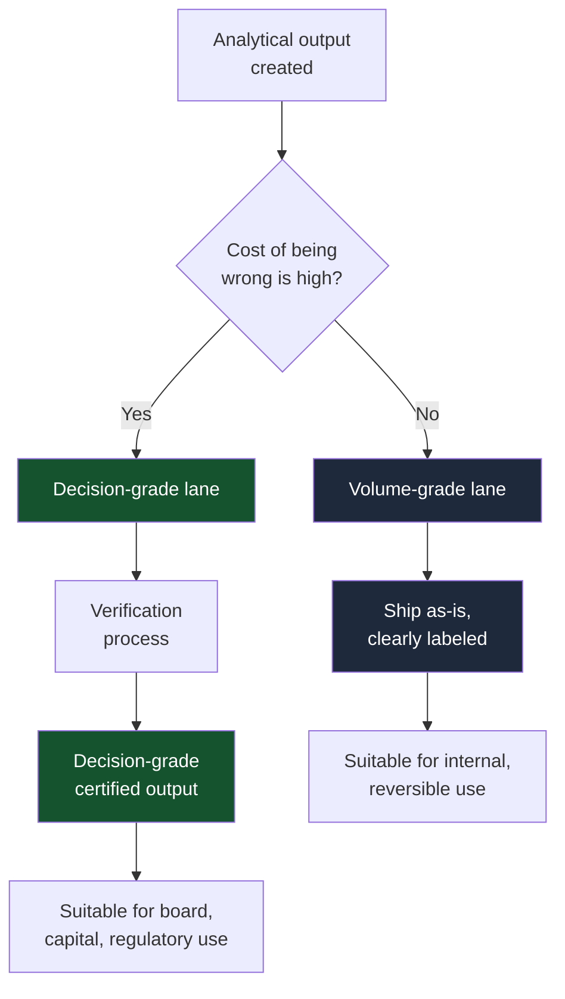
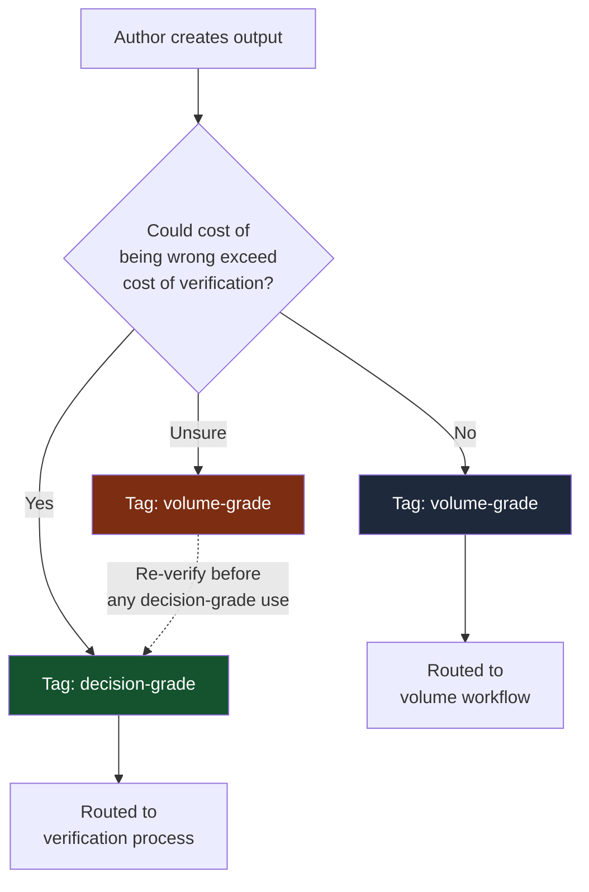

The Buyer's Checklist tells you what to demand from vendors. Lane Discipline tells you what to build inside your own organization. It is the operational practice that separates the decision-grade lane (slow, expensive, verified) from the volume-grade lane (fast, cheap, unverified) and prevents content from crossing between them without re-verification.

If you take only one operational practice from this framework, take this one. Lane discipline is the difference between an organization that benefits from AI-augmented analysis and one that quietly poisons its own decision-making with it.

<Note>
  **In short:** Verification is expensive. Demanding it on every output is absurd. The fix is segmentation: a decision-grade lane where buyers pay for verification, and a volume-grade lane where speed dominates. The failure mode is content sliding between lanes without re-verification. The single most expensive mistake: a volume-grade memo becoming the basis for a board decision.
</Note>

## Two lanes, one rule

Verification is expensive and slow. That is precisely why it was the first thing cut under throughput pressure (see [The Frame](/the-frame)), and it is why demanding it on every analytical output would be absurd.

Most analytical work does not need to be audited. Most internal synthesis is reversible, exploratory, or context-setting. Forcing verification on those outputs would collapse cycle time without producing proportional value.

The market segments. A decision-grade lane, where buyers pay for verification and producers invest in it. A volume-grade lane, where speed and cost dominate and everyone knows what they are getting. Two lanes can coexist. The danger is not that they exist. The danger is that organizations fail to separate them, letting volume-lane output slide into decision-grade use.

## What goes in which lane

The decision criterion is the cost of being wrong, not the importance of the topic.

<CardGroup cols={2}>
  <Card title="Decision-grade lane" icon="shield">
    **Cost of being wrong is high.** Capital allocation, M&A targets, regulatory submissions, board memos, crisis response briefs, public-facing analytical claims, anything where being wrong moves money, lives, policy, or reputation.

    **Audience includes external parties.** Regulators, board, investors, partners, courts.

    **Decision is binding or hard to reverse.** Once acted on, you cannot quietly walk it back.

    **Reasoning will be challenged.** Litigation, audit, board pushback, regulatory review, journalist inquiry.
  </Card>

  <Card title="Volume-grade lane" icon="bolt">
    **Cost of being wrong is low.** Internal context-setting, first-draft synthesis, meeting prep, learning material, brainstorming output, weekly market summaries.

    **Audience is internal.** Your team, your function, an internal working group.

    **Decision is reversible.** Whatever the output prompts, you can adjust without external consequence.

    **Reasoning is not the deliverable.** The synthesis is the value, and the synthesis is provisional.
  </Card>
</CardGroup>

Most output produced inside an organization is volume-grade. That is fine. The error is treating any of it as decision-grade by default, or letting it slide there without re-verification.

## How to classify at point of production

Lane assignment has to happen when content is created, not after. If classification happens after the fact, the classifier is usually the same person who would benefit from the content being treated as decision-grade. That is a corrupting incentive.

The practical rule: every analytical artifact carries a lane tag at the moment of creation. The tag is metadata, not decoration. It travels with the file, the deck, the memo, the briefing note.

<Tip>
  **The diagnostic question for the author:**

  "Could the cost of being wrong about this output exceed the cost of having it verified?"

  If yes, decision-grade. If no, volume-grade. If unsure, treat as volume-grade and require re-verification before any decision-grade use.
</Tip>

The classification needs to be visible to every downstream reader. A volume-grade memo that ends up on a CEO's desk should be obviously volume-grade. Not because the content is less rigorous (it might be perfectly rigorous), but because the reader needs to know what verification posture was applied.

## Routing rules

Three rules govern movement between lanes.

<Steps>
  <Step title="Volume-grade content cannot become the basis for a decision-grade decision">
    Without re-verification. The labeling rules out the lazy path: pulling last week's volume-grade synthesis and using it as the foundation for a board memo because it is "already written."

    If you want to use volume-grade content in a decision-grade context, it goes through the verification process. Otherwise it does not get used.
  </Step>

  <Step title="Decision-grade content can be downgraded">
    For volume-grade use. Re-verification is not required. The verification you paid for once was sufficient; using the content in a lower-stakes context does not retroactively raise the bar.

    The lane label can be downgraded by anyone. Upgrading requires a verification step.
  </Step>

  <Step title="Labels travel with content">
    Every excerpt, every quoted line, every screenshot in a downstream document inherits the lane label of the source. A board memo that quotes a volume-grade analysis is, at that quoted moment, importing volume-grade reasoning into a decision-grade context.

    Either the quoted material was re-verified before inclusion (it becomes decision-grade for this purpose) or the board memo is now downgraded for the portions that depend on the quoted material. There is no third option.
  </Step>
</Steps>

## Five ways lane discipline fails

Each failure is invisible in the moment and only obvious in the post-mortem. Knowing the failure modes in advance is most of the defense.

<CardGroup cols={1}>
  <Card title="1. The unlabeled slip" icon="triangle-exclamation">
    Volume-grade synthesis passed up the chain arrives in a decision-grade context with no label. Decision-makers treat it as decision-grade because it looks like everything else they read.

    **Fix:** Labels mandatory at point of creation. Unlabeled content defaults to volume-grade. Quotes inherit source labels.
  </Card>

  <Card title="2. The theater inversion" icon="mask">
    Everything gets labeled "decision-grade" because labeling something volume-grade looks like the author is not taking the work seriously. The lane distinction collapses.

    **Fix:** Decision-grade must carry a real verification cost. If verification is not happening, the label is theater. The label must correspond to a process difference.
  </Card>

  <Card title="3. The verification lock-in" icon="clock">
    Decision-grade verification becomes so slow that nothing makes it through. The organization defaults to volume-grade for decision-grade purposes because the alternative is missing the deadline.

    **Fix:** Verification has to fit real cycle times. A verification system that adds three weeks to every board memo is a bottleneck, not a verifier.
  </Card>

  <Card title="4. The attention inversion" icon="eye">
    Volume-grade content gets more leadership attention than decision-grade because there is more of it. What gets rewarded gets repeated: speed to inbox, zero stakeholder friction, confident language. What gets ignored: forecast scoring, postmortem accuracy, explicit uncertainty. The decision-grade lane becomes vestigial.

    **Fix:** Decision-grade outputs need clear routing to the decision-makers. Volume-grade outputs need clear routing away from them unless explicitly requested. Performance reviews need to score accuracy alongside speed.
  </Card>

  <Card title="5. The inline-friction revolt" icon="person-running">
    Inline verification is inserted into the decision-grade workflow. The compliant lane becomes slower than the informal one. Users route around it through personal accounts, copy-paste, and unlogged tools. Telemetry inside the lane looks healthy because the work that would have produced bad telemetry is no longer in the lane.

    **Fix:** The auditable exception path must be faster than the unsanctioned workaround. Build a logged override route with named manager review, reason codes, and post-release audit, and time it against email-and-paste under deadline pressure. If the override is slower than the bypass, users will choose the bypass and the bypass will get faster. Measure bypass signals (override request rate, copy-paste to unmanaged tools, exception requests after controls go live) as a first-class metric, not as an aside.
  </Card>
</CardGroup>

## What lane discipline looks like in practice

The simplest implementation is a metadata tag, a routing rule, and a periodic audit. Start narrow.

<Steps>
  <Step title="Start with one named workflow class">
    Crisis-response briefs, regulatory submissions, or the analytical sections of board packs are good first candidates. Each has a visible failure cost and a bounded volume. Add a second class only after the first lane has run one full operating cycle and the slippage audit comes back clean. Org-wide adoption from day one is the path that produces theater inversion the fastest.
  </Step>
  <Step title="Tag every analytical artifact at creation">
    File naming convention, document header field, content management system tag, or watermark. Form does not matter as long as it is mandatory, visible, and travels with the content.
  </Step>
  <Step title="Enforce routing by tag">
    Decision-grade outputs go through verification before they can leave the analytical layer. Volume-grade outputs do not. Software that routes content between systems respects the lane.
  </Step>
  <Step title="Audit periodically for slippage">
    Sample recent board decisions, capital allocation memos, regulatory submissions, public statements. Trace the analytical content underneath. What fraction was decision-grade at the moment of decision?
  </Step>
</Steps>

### Before selective skipping: measure routing recall

The lane only saves effort if the router catches the documents that matter. Routing recall is the share of high-stakes documents the router actually routes into the decision-grade lane, measured against a labeled sample of live traffic rather than against benchmark performance the vendor advertises.

Until recall is measured, selective skipping is unsafe. The lane should default to wider intake. Set the recall floor from baseline data before the first selective-skip rule is enabled, and require live re-measurement on the published cadence rather than at vendor onboarding only. False negatives, where decision-grade work is routed to the volume-grade lane, are the framework's signature failure. Routing recall is the metric that catches them before the slippage audit does.

### Operational specifics worth deciding upfront

The three-step pattern needs five operational decisions before it survives contact with a real organization. Resolve these before the first lane label gets assigned, or you will retrofit them under pressure.

<AccordionGroup>
  <Accordion title="Who can assign the lane label">
    The author at point of creation, with a designated supervisor sign-off required for decision-grade. The supervisor sign-off is the moment verification cost commits. Letting the author self-promote to decision-grade without a second signature is the most common source of theater inversion.
  </Accordion>

  <Accordion title="Who can upgrade volume-grade to decision-grade">
    Only via re-verification, never by reassignment. The upgrade gate is the same gate as original decision-grade certification. No expedited paths, no exceptions. Upgrade without re-verification turns the lane into a status marker rather than a process commitment.
  </Accordion>

  <Accordion title="How embedded content inherits labels">
    Slides quoting a memo. Memos quoting research. Briefs quoting summaries. The label of the embedded content travels with it. A decision-grade slide containing a volume-grade quote is, for the duration of the quote, importing volume-grade reasoning. Either the quoted material is re-verified before inclusion, or the slide is downgraded for the portions that depend on it.
  </Accordion>

  <Accordion title="Audit sample size and cadence">
    Sample 10% of decision-grade outputs each quarter, minimum 20 documents. Trace the analytical content underneath to its source labels. Where the trace breaks, log the slippage and route it to a fix. The audit is the only way to detect theater inversion before it becomes culture. Two coders per audit improves inter-rater reliability; one coder is better than none.
  </Accordion>

  <Accordion title="Exception logging when overrides happen">
    Overrides will happen: deadline pressure, executive request, regulatory urgency. Log every override explicitly. Who approved, what was overridden, why, what compensating controls were in place, and what date the override expires. The exception log becomes its own discriminating signal over time. A team that overrides every week has a process problem. A team that has never overridden has a theater problem.
  </Accordion>
</AccordionGroup>

<Tip>
  **The single board-level metric:**

  "Of the analytical content that informed your last ten board-level decisions, what percentage carried a decision-grade label at the moment of decision?"

  | Score | Interpretation |
  |---|---|
  | Below 50% | Lane discipline is failing. Slippage is the norm. |
  | 50% to 80% | Lane discipline is partial. Audit the gaps. |
  | Above 80% | Lane discipline is working. Audit periodically. |
  | Exactly 100% | Either exceptional or theater is winning. Audit the verification, not the labels. |
</Tip>

## What this is not

Three inoculations against common misreadings.

<CardGroup cols={3}>
  <Card title="Not AI suppression" icon="ban">
    The volume-grade lane is where most AI-augmented analysis appropriately lives. Forcing decision-grade verification onto everything is not a solution.
  </Card>
  <Card title="Not a replacement for the Buyer's Checklist" icon="list-check">
    The two reinforce each other. The Buyer's Checklist makes the verification you buy real. Lane Discipline makes the verification you bought useful.
  </Card>
  <Card title="Not a permanent state" icon="arrows-rotate">
    What counts as decision-grade in 2026 may not in 2028. The lane criteria are worth revisiting as AI capabilities, regulation, and competitive context shift.
  </Card>
</CardGroup>

## Where this goes next

<CardGroup cols={3}>
  <Card title="2026 Watchlist" icon="calendar" href="/watchlist">
    Dated signals over the next 18 months that will tell you whether the framework holds.
  </Card>
  <Card title="The Doctrine" icon="shield" href="/the-doctrine">
    The architectural commitments that make decision-grade verification real.
  </Card>
  <Card title="The Buyer's Checklist" icon="list-check" href="/buyers-checklist">
    The seven procurement questions that determine what your decision-grade lane is buying.
  </Card>
</CardGroup>
