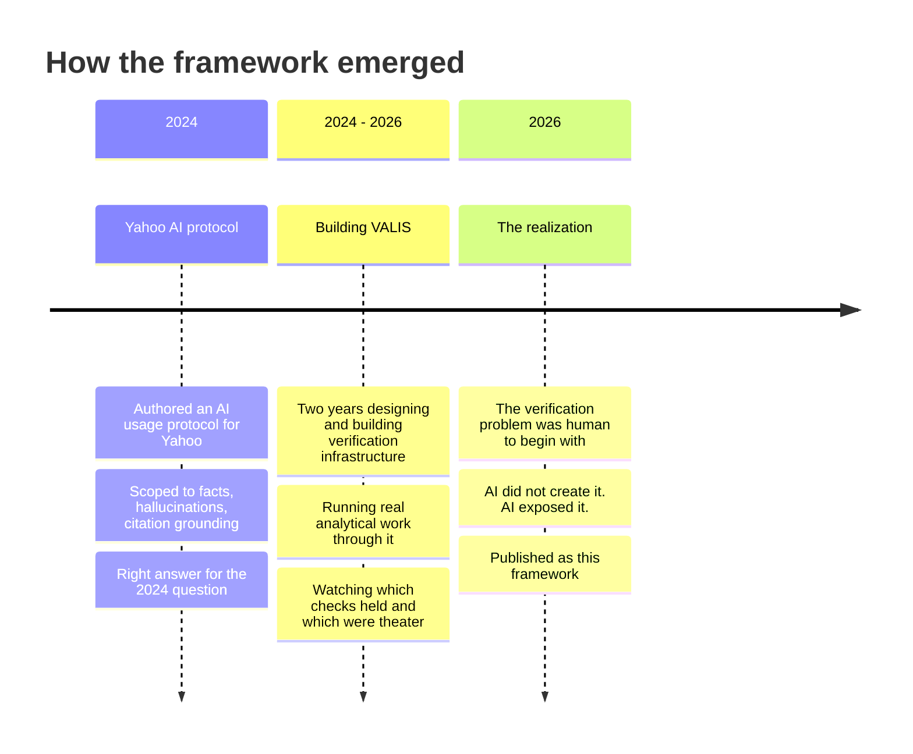

<Note>
  **Disclosure first.** This site is published by VALIS Systems. The author is the founder. VALIS builds AI verification infrastructure in the category this framework describes. That commercial interest is acknowledged in every direction this document can be read.

  The doctrine itself is independent of any specific product. The framework is published openly because the Zero Trust posture it advocates extends to the doctrine itself. You should not have to trust the publisher.
</Note>

## Why this framework exists

The arguments on this site come from a specific path. The three pieces that produced the framework, in order.

### Yahoo, 2024: the protocol that was right for its moment

In 2024, I authored an AI usage protocol for Yahoo. It was scoped to what the AI conversation was actually about at the time: making sure models did not fabricate facts, that citations grounded back to sources, that AI use was disclosed, that human review was in the loop. It was a reasonable response to the AI landscape of 2024.

It was also the wrong frame for where things were going. The realization came over the following months as models improved on the hallucination axis faster than the protocols I had written assumed. The remaining failure mode was no longer getting the facts wrong. It was producing fluent, well-cited, hallucination-free output that still reasoned badly. The 2024 toolkit was solving the visible problem. The problem was changing underneath it.

### 2024 to 2026: building VALIS

From 2024 to 2026, I designed and built VALIS. The work was equal parts engineering and analysis. We ran real verification through the system. We saw which architectural commitments held under pressure and which were performative. We saw what verification at scale actually requires when you cannot quietly soften it for a deadline or a difficult client.

Three observations crystallized over those two years.

<CardGroup cols={3}>
  <Card title="Verification cost is structural" icon="weight-scale">
    Verification does not get cheaper at the rate generation does. It runs on a different cost curve. That asymmetry is the operational risk most organizations have not yet priced.
  </Card>
  <Card title="Trust models matter more than features" icon="shield">
    A product that asks the customer to trust the verifier is a different category from one that produces independently checkable verification. The architectural commitments define the category.
  </Card>
  <Card title="The deficit was already there" icon="magnifying-glass">
    AI did not create the verification deficit. AI made it impossible to ignore. The same gap existed in human-produced analytical content for decades. We just could not see it.
  </Card>
</CardGroup>

### 2026: the realization that drives this framework

By early 2026, the central observation crystallized.

<Tip>
  The verification problem was human to begin with. AI exposed it. Anything we build to address AI verification has to address the deeper deficit underneath it.
</Tip>

That observation reframed everything. The framework on this site is the distillation of that reframing: the doctrine, the architecture, the operational practice. Published openly because the doctrine should survive the publisher, the company, and the founder.

## What this framework is, and is not

The framework is a directional reading of where AI verification is heading. It is not a guarantee, not legal advice, not investment guidance.

<CardGroup cols={3}>
  <Card title="Not legal advice" icon="scale-balanced">
    The procurement and contracting recommendations on this site are framing, not legal counsel. Have your counsel review any specific contract language before signing.
  </Card>
  <Card title="Not investment advice" icon="chart-line">
    References to capital market signals in the [Watchlist](/watchlist) are framework-test signals, not investment recommendations. Apply your own diligence.
  </Card>
  <Card title="Not a guarantee" icon="circle-question">
    The framework predicts a market correction is likely within 18 months. The Watchlist names the dated signals that will test the prediction. The prediction could be wrong, and the framework specifies how it would fail.
  </Card>
</CardGroup>

The framework is general. Your situation is specific. Use the doctrine, the buyer's checklist, and the lane discipline practices as inputs to your own thinking, not as a substitute for it.

## What the framework owes the reader

The Zero Trust posture extends to the framework itself. Four commitments.

<CardGroup cols={2}>
  <Card title="Verifiable" icon="circle-check">
    The source is public. The framework is published in AI-readable form (see [llms.txt](https://decision-grade.ai/llms.txt) and [llms-full.txt](https://decision-grade.ai/llms-full.txt)). Anyone can audit the arguments.
  </Card>
  <Card title="Forkable" icon="code-fork">
    Licensed under [Creative Commons Attribution 4.0](https://creativecommons.org/licenses/by/4.0/). Use, adapt, build on it, with attribution. Implement the doctrine elsewhere if you want to.
  </Card>
  <Card title="Contestable" icon="comments">
    Substantive disagreements are welcome via [issues and pull requests](https://github.com/DavidVALIS/decision-grade) on the repository. The doctrine improves when it is contested.
  </Card>
  <Card title="Testable" icon="flask">
    The [2026 Watchlist](/watchlist) specifies dated signals that will tell you (and me) whether the framework holds. A framework that does not specify how it could be wrong is not a framework.
  </Card>
</CardGroup>

## Author

David Lundblad. Founder of VALIS Systems. Previously authored Yahoo's AI usage protocol (2024). Two years designing and building VALIS (2024-2026). Publishing this framework as the distillation of that work.

Reach me through:

<CardGroup cols={2}>
  <Card title="Substantive engagement" icon="github" href="https://github.com/DavidVALIS/decision-grade">
    Issues and pull requests on the repository. Open the framework, contest it, fork it.
  </Card>
  <Card title="Commercial inquiry" icon="briefcase" href="https://valissystems.com">
    VALIS Systems. The reference implementation of the doctrine on this site.
  </Card>
</CardGroup>

## Where this goes next

<CardGroup cols={3}>
  <Card title="The Frame" icon="diagram-project" href="/the-frame">
    Start with the diagnosis: why current AI controls miss the real problem.
  </Card>
  <Card title="The Doctrine" icon="shield" href="/the-doctrine">
    The Zero Trust posture, in three layers.
  </Card>
  <Card title="The Buyer's Checklist" icon="list-check" href="/buyers-checklist">
    Seven procurement questions to put to AI vendors.
  </Card>
</CardGroup>
