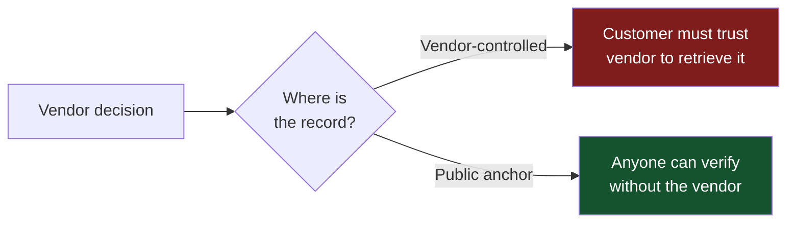
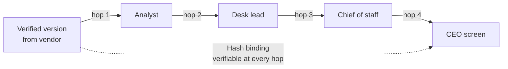

<Note>
  **In 60 seconds.** Seven procurement questions you can put to any AI vendor claiming verification. Each one tests one architectural commitment from The Doctrine. Score on a five-point scale, sum across seven, walk away from anyone below 15. The single-sentence test that compresses all of them: *can I verify your verdicts without having to trust you?* The most useful thing you can do this quarter is add the seven questions, exactly as worded below, to your next AI vendor RFP.
</Note>

If you only read one page on this site, read this one. It translates The Doctrine into the specific questions you should put to any AI vendor claiming to verify analytical output, what a serious answer looks like, and what to walk away from.

<Note>
  **The single sentence test:**

  "Can I verify your verdicts without having to trust you?"

  If the answer requires trusting the vendor, the vendor is selling perimeter security. If the answer is "yes, here is how," you are talking to a Zero Trust verifier. The seven questions below unpack what that single sentence means in procurement language.
</Note>

<Tip>
  **The single most useful thing you can do this quarter.** Add the seven questions below, exactly as worded, to your next AI vendor RFP. Score the answers on the five-point scale. Decision-grade threshold is 22 or above. Below 15 is volume-lane only. Share the scores with your peers. Procurement signals compound when they propagate.
</Tip>

**How to use this page.**

The seven questions travel into a vendor evaluation. Each one corresponds to one of the seven architectural commitments in The Doctrine. Score each answer on a five-point scale:
- **0** No answer.
- **1** Marketing answer.
- **2** Process answer.
- **3** Architectural answer with limitations named.
- **4** Architectural answer with public commitments.
- **5** Architectural answer with public commitments and cryptographic verification you can run yourself.

A vendor that scores below 2 on any question is not a Zero Trust verifier. They may still be useful for volume-grade work. They should not be in your decision-grade lane.

## The seven questions at a glance

<Steps>
  <Step title="Independent verification">
    Which model families verify your output? What happens when they disagree?
  </Step>
  <Step title="Architectural enforcement">
    Show me a rule that fires deterministically. Can it be turned off?
  </Step>
  <Step title="Cryptographic anchoring">
    How do I verify a decision without going through you?
  </Step>
  <Step title="Public refusal logs">
    Where is your refusal log? Show me a specific refusal.
  </Step>
  <Step title="Rubric transparency">
    What rubric version am I being graded against? Show me the change log.
  </Step>
  <Step title="Source-document binding">
    How does my CEO know they're looking at the version you certified?
  </Step>
  <Step title="Doctrine survives change">
    What happens to my certificates if you are acquired?
  </Step>
</Steps>

---

## 1. Independent verification across model families

**The question:** Which model families participate in your verification process? What happens when they disagree, and how is that disagreement recorded?

<CardGroup cols={2}>
  <Card title="A serious answer" icon="circle-check">
    Names two or more independent model families. Describes the adjudication protocol (majority vote, weighted vote, mandatory consensus, escalation path). Confirms dissent is recorded in a form the customer can audit.
  </Card>
  <Card title="A worrying answer" icon="circle-xmark">
    "We use the best model for the job." "We use an ensemble." "We have human reviewers." None of those answer the question. The follow-up: which families, what protocol, how is dissent recorded?
  </Card>
</CardGroup>

<Warning>
  **Red flags:**
  - A single model family doing both generation and verification
  - "Our model checks itself" or "we run a verifier prompt"
  - An ensemble that is several models from the same family
  - A human-in-the-loop that only sees what the model has already approved
</Warning>

**Why it matters:** Same model, same blind spots. Same training data, same biases. Verification by the same family is the cognitive equivalent of asking a witness to corroborate their own testimony.

---

## 2. Architectural enforcement of doctrine

**The question:** Show me a rule your system claims to enforce. Walk me through the architecture that enforces it. Confirm the rule cannot be bypassed, even by your team, even when commercially convenient.

<CardGroup cols={2}>
  <Card title="A serious answer" icon="circle-check">
    Picks a specific rule (an evidence gate, a citation requirement, a refusal trigger). Describes the code path that enforces it. Can answer "what happens if you wanted to ship without this rule firing" with "we cannot, here is why."
  </Card>
  <Card title="A worrying answer" icon="circle-xmark">
    "Our policy is to..." "Our reviewers always..." "We have a process for..." Policies and processes are operator-dependent. Architecture is not.
  </Card>
</CardGroup>

<Warning>
  **Red flags:**
  - The vendor describes policies instead of mechanisms
  - The rule has exceptions the vendor can grant
  - "We can turn that off for enterprise customers"
  - The enforcement lives in a runbook, not in code
  - The primary gate relies on inferring board, regulatory, or capital-allocation consequence from free text rather than from structured artifact metadata
</Warning>

**Why it matters:** Documentation does not enforce itself. Style guides do not catch errors. Performance reviews do not improve reasoning. If the only thing between the rule and a violation is operator memory or operator discretion, the rule is aspirational.

Free-text consequence inference is the failure mode worth naming separately. Hard gates are strongest on structured properties (template class, source presence, citation count, named reviewer). They weaken sharply when they must guess from prose whether an arbitrary memo carries board consequence. A vendor that treats semantic materiality inference as the primary gate is selling perimeter security with extra steps.

---

## 3. Cryptographic anchoring of decisions

**The question:** Pick any verification decision you have made for a customer. How do I independently verify that decision, right now, without going through you?

<CardGroup cols={2}>
  <Card title="A serious answer" icon="circle-check">
    Provides a cryptographic anchor (transparency log entry, public chain commitment, signed certificate resolving against an authority the vendor does not control). Walks you through verification: "click this link, run this command, get this confirmation."
  </Card>
  <Card title="A worrying answer" icon="circle-xmark">
    "We have an audit log." "We can pull the record for you." "Our records are tamper-resistant." Tamper-resistant is not tamper-evident. Vendor-controlled records are not independent.
  </Card>
</CardGroup>

<Warning>
  **Red flags:**
  - The audit log is hosted on the vendor's infrastructure
  - The vendor is the only party who can confirm a record is authentic
  - "Tamper-resistant" without an external anchor
  - Records that can be "amended" or "updated" rather than appended
</Warning>

**Why it matters:** If the integrity of the record depends on the vendor behaving well, the integrity of the record is not verifiable. After a failure event, the vendor's records are the first thing that becomes contested.

<Note>
  **Anchoring under confidentiality.**

  Globally public anchoring leaks existence proofs that are unacceptable for privileged legal advice, M&A strategy, export-controlled data, PHI/PII, or confidential board material. The doctrine survives by moving from a public chain to a customer-controlled transparency log with selective disclosure: chain integrity verifiable by the customer internally, external parties get redacted or zero-knowledge proofs only as the matter requires. A vendor whose only answer to confidential workflows is "we anchor to a public chain" has not yet engineered for the workflows that matter most. A vendor that documents a customer-controlled boundary with the same tamper-evidence guarantees is operating the doctrine at its actual stakes.
</Note>

---

## 4. Public refusal logs

**The question:** Where is your refusal log? Show me a specific refusal from the last 30 days. Walk me through how you would audit a refusal pattern over time.

<CardGroup cols={2}>
  <Card title="A serious answer" icon="circle-check">
    Points to a publicly accessible or customer-auditable log. Can produce specific refusals on demand. Explains the structure, the review cadence, and how refusal patterns are aggregated.
  </Card>
  <Card title="A worrying answer" icon="circle-xmark">
    "We don't refuse often." "We log internally with no audit trail." "We have a process if there is an issue." Internal-only logs that the customer cannot query are theater. Customer-auditable logs (with privacy-preserving access controls, salted commitments, or per-customer keys) are acceptable. Globally public is one valid option but not the only one.
  </Card>
</CardGroup>

<Warning>
  **Red flags:**
  - No refusal log at all
  - A log only the vendor can read and curate before you see it
  - Refusals that are reviewed but never queryable
  - A vendor uncomfortable showing you specific refusals you have a right to inspect
</Warning>

**Why it matters:** A vendor's pattern of what they refuse to do is a more durable signal of integrity than any methodology statement. The log does not have to be globally public if the customer can audit it. What matters is that the pattern is queryable by parties outside the vendor, and the vendor cannot quietly curate which refusals are visible to which customers.

---

## 5. Rubric-version transparency

**The question:** What rubric version am I being graded against right now? How would I detect if you changed it? Show me the change log for the last three rubric versions.

<CardGroup cols={2}>
  <Card title="A serious answer" icon="circle-check">
    Provides a public hash of the active rubric per customer. Maintains a change log with timestamps and reasons. Can produce the diff between any two versions. Has a notification process when rubrics change.
  </Card>
  <Card title="A worrying answer" icon="circle-xmark">
    "We continuously improve our methodology." "Our rubrics evolve." "We do not share rubrics externally." Rubric drift without transparency is how the AAA stamp lost its meaning between 2000 and 2008.
  </Card>
</CardGroup>

<Warning>
  **Red flags:**
  - No version control on rubrics
  - Rubrics that can be silently updated
  - "Methodology is proprietary" with no version hash exposed
  - Different rubrics applied to different customers without disclosure
</Warning>

**Why it matters:** A verification grade is only meaningful if you know what it was graded against. A vendor that can quietly change the rubric can quietly redefine what "verified" means without telling you.

---

## 6. Source-document hash binding

**The question:** When my CEO opens the analytical artifact you delivered, how do they know they are looking at the version you certified? How do I detect a substitution somewhere between your system and their screen?

<CardGroup cols={2}>
  <Card title="A serious answer" icon="circle-check">
    Certificate format includes a cryptographic hash of the source document. Verification can be performed independently. If the document is modified, even by one character, verification fails. The hash is checkable by anyone, not just the vendor.
  </Card>
  <Card title="A worrying answer" icon="circle-xmark">
    "We send a PDF." "We sign the document." "We track versions." Signing is necessary but not sufficient if both signing and verification happen on the vendor's side.
  </Card>
</CardGroup>

<Warning>
  **Red flags:**
  - No hash binding between source and certificate
  - Verification only possible through the vendor's portal
  - "Trusted intermediaries" who can re-sign on the way to the executive
  - Document workflows where the version that gets executive review is not the version that was verified
</Warning>

**Why it matters:** A verified analysis is only useful if the decision-maker reads the verified version. Between the verifier and the executive, there are usually three to five organizational hops. Each hop is a substitution opportunity. The hash closes the gap.

---

## 7. Doctrine survives institutional change

**The question:** What happens to my certificates if you are acquired? If your founder leaves? If the company changes hands? Will the verification I bought today still validate in five years?

<CardGroup cols={2}>
  <Card title="A serious answer" icon="circle-check">
    Certificates are anchored to public infrastructure the vendor does not control. The vendor's signing key is part of the certificate; if the key changes, the change is visible in the public chain. The doctrine is constitutional rather than corporate.
  </Card>
  <Card title="A worrying answer" icon="circle-xmark">
    "We're not planning to be acquired." "We would honor existing customers." "Our records would persist." None answer the question, because all depend on the vendor's continued cooperation.
  </Card>
</CardGroup>

<Warning>
  **Red flags:**
  - The verification only works while the vendor is operating
  - Certificates that "expire" or require renewal through the vendor
  - No visible mechanism for detecting a regime change at the vendor
  - "Trust us" answers when asked about acquisition scenarios
</Warning>

**Why it matters:** The lifetime of a strategic decision often exceeds the lifetime of any specific vendor. A verification system that depends on the vendor's continued goodwill is not Zero Trust. It is perimeter trust with extra steps.

---

## How to score a vendor

Sum the scores across the seven questions. The maximum is 35.

<CardGroup cols={2}>
  <Card title="0 to 7" icon="circle-xmark">
    Marketing claims. Not a verification system. Suitable for volume-lane work only.
  </Card>

  <Card title="8 to 14" icon="circle-half-stroke">
    Process-based. Useful but not Zero Trust. Acceptable for low-stakes work.
  </Card>

  <Card title="15 to 21" icon="circle-check">
    Architectural posture. Real engineering investment. Suitable for most decision-grade work.
  </Card>

  <Card title="22 to 28" icon="shield-halved">
    Zero Trust with public commitments. A serious verification partner.
  </Card>
</CardGroup>

<CardGroup cols={1}>
  <Card title="29 to 35" icon="shield">
    Full Zero Trust with cryptographic verification you can run yourself. The category leader.
  </Card>
</CardGroup>

A vendor that refuses to engage with one or more of these questions has answered them. The refusal is the answer.

<Note>
  **A note on these thresholds.** The 22, 28, and 35 bands are provisional. They have not been calibrated against measured verification quality across a representative vendor sample. Use them as a comparative ranking within your RFP process, not as a certification regime. As more vendors are scored against these questions, the thresholds will be revised upward or downward, and the change log will be visible in the [repository](https://github.com/DavidVALIS/decision-grade).
</Note>

## On the current state of the category

At the time of writing, no vendor scores full marks across all seven questions. That is not necessarily a problem. Categories define their bar before they are populated; the buyer's lever works by asking, not by waiting for a vendor that already passes. If your evaluation produces a top score of 18, that tells you something about the market more than about the seven vendors you scored. The market is still being built. Your asking is part of building it.

## The buyer's lever

You do not need every vendor in your market to pass this checklist. You need to ask the questions. The asking itself moves the market.

The framework predicts the same correction will arrive in AI verification within the next 18 months. The earliest movers will be regulated industries, large institutional buyers, and government procurement. The later movers will follow the public failure events. Your buying power is the lever that pulls the correction forward in your market.

<Tip>
  **The single most useful thing you can do this quarter:**

  <Steps>
    <Step title="Add the seven questions to your next AI vendor RFP">
      Word them exactly as they appear on this page. Vendor familiarity with the framing is itself a signal.
    </Step>
    <Step title="Score the answers using the five-point scale">
      Decision-grade threshold is 22 or above. Below 15 is volume-lane only.
    </Step>
    <Step title="Share the scores with your peers">
      Procurement signals compound when they propagate. The early movers do the most work; the late movers benefit from the market floor that early movers built.
    </Step>
  </Steps>
</Tip>

## Where this goes next

<CardGroup cols={2}>
  <Card title="Lane Discipline" icon="signs-post" href="/lane-discipline">
    What to build inside your organization: decision-grade vs. volume-grade routing.
  </Card>
  <Card title="The Doctrine" icon="shield" href="/the-doctrine">
    The Zero Trust posture the seven questions rest on.
  </Card>
  <Card title="2026 Watchlist" icon="calendar" href="/watchlist">
    Dated signals over the next 18 months that test the framework.
  </Card>
</CardGroup>
