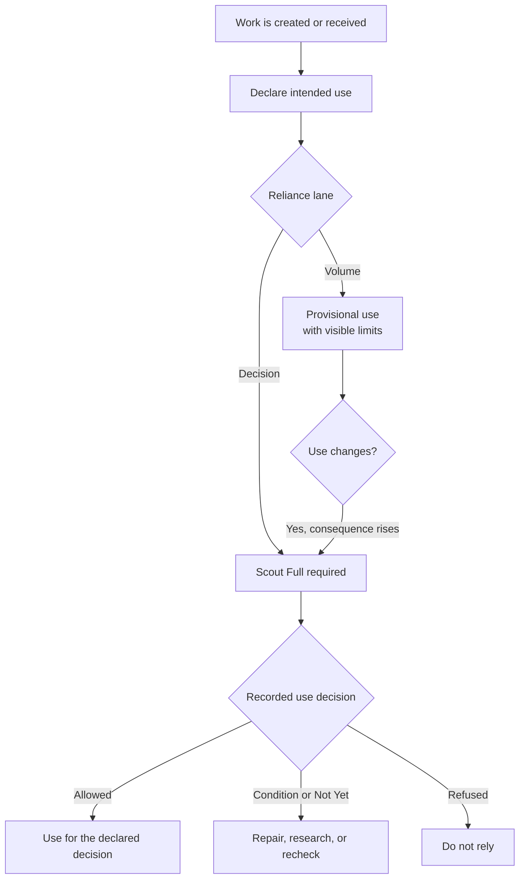

<Note>
  **Two lanes, one distinction.** Volume work is provisional, reversible, and lower cost of error. Decision work may move capital, rights, policy, safety, fiduciary duty, regulation, reputation, or another difficult-to-reverse outcome. The lane describes intended reliance, not the document's permanent quality.
</Note>

The same memo may begin as exploratory work and later enter a consequential decision. The document did not change class. The reliance changed.

That is why lane discipline belongs at the point of use, not as a decorative label attached once and carried forever.

## Volume and Decision

| | Volume lane | Decision lane |
|---|---|---|
| **Use** | Developing, provisional, reversible | Consequential, difficult to reverse |
| **Examples** | Working synthesis, meeting preparation, idea development, early comparison | Capital allocation, rights, policy, safety, fiduciary, regulatory, board, or material reputation decisions |
| **Default** | Unlabeled work enters here | Must be declared |
| **Rapid** | May triage while work changes | May triage, but cannot clear reliance |
| **Full** | May be used when deeper review is warranted | Required before consideration |
| **Completion** | Does not imply outside truth | Does not automatically clear use |

Volume does not mean careless. Decision does not mean prestigious. The labels exist to match review force to the cost of error.

## The operating flow

The practical rule is straightforward: if the work moves into a more consequential use, the review must be reconsidered for that use.

## Rapid is triage, not clearance

Rapid may identify issues while a document is changing. It can be useful in either lane, including work that may later support a consequential decision.

Rapid never clears Decision work.

Full is the deeper process required before Decision-lane consideration. Full completion is still not automatic clearance. The result may allow the use, impose a condition, require more work, or refuse.

## Decision Grade does not travel by inheritance

A Decision Grade disposition is bound to a document version and declared use.

It does not automatically travel when:

- the document changes materially;
- an excerpt is placed in a new argument;
- the audience or decision changes;
- new evidence changes an important assumption;
- several checked documents are synthesized into a new analysis; or
- a scenario, forecast, backcast, or recommendation is built on top.

The source material may be stronger because it was checked. The new use and new reasoning still need their own treatment.

## Five common failures

<CardGroup cols={1}>
  <Card title="1. Unlabeled work reaches a consequential decision" icon="triangle-exclamation">
    A working brief is forwarded upward and treated as cleared because it looks finished.

    **Control:** Unlabeled material defaults to Volume and may not support Decision-lane reliance without reclassification and Full.
  </Card>

  <Card title="2. Every important document is called Decision Grade" icon="mask">
    The term becomes praise rather than a recorded disposition.

    **Control:** Reserve Decision Grade for Scout Full, one declared use, and an earned allowed disposition.
  </Card>

  <Card title="3. Rapid becomes the deadline shortcut" icon="clock">
    Triage is treated as clearance because Full takes longer.

    **Control:** Make the resulting action state explicit. Rapid can indicate; it cannot clear Decision reliance.
  </Card>

  <Card title="4. The label survives a change in use" icon="arrows-rotate">
    A result earned for internal discussion is reused for a board, investor, regulatory, or capital decision.

    **Control:** Bind the disposition to the use and require re-evaluation when reliance changes.
  </Card>

  <Card title="5. The controlled path is slower than the workaround" icon="person-running">
    Users move work through email, personal accounts, or copy-and-paste to meet a deadline.

    **Control:** Measure bypass signals and provide a fast, recorded exception path with named authority and recheck requirements.
  </Card>
</CardGroup>

## What to record

For each Decision-lane use, keep:

1. The document and exact version.
2. The declared use and responsible decision owner.
3. The lane assignment and why it applies.
4. The check performed and configuration used.
5. Material findings, disagreements, and outside-research needs.
6. The action state: allowed, conditioned, held, or refused.
7. Any override, authority, reason, and recheck path.

## What to measure

Do not invent a universal percentage of documents that should be in either lane.

Measure the workflow with named denominators:

- Decision-lane documents that received Full before reliance.
- Rapid results later used without Full.
- Use changes that triggered reclassification.
- Conditions or holds resolved before action.
- Overrides, bypass signals, and time to responsible review.
- Material issues found after reliance that the process should have caught.

The goal is not a perfect dashboard. It is to know whether consequential work is reaching the decision-maker with its review state and limits intact.
