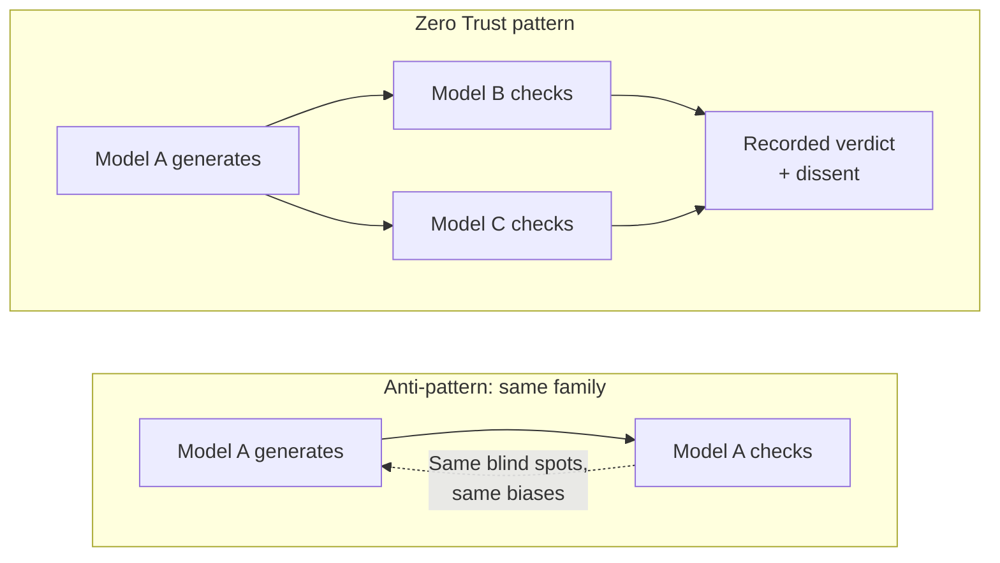

<Note>
  **In 60 seconds.** The customer should not have to trust the verifier. Zero Trust applied to AI verification, in three layers. **Independence**: no single AI family verifies its own work. **Architectural enforcement**: rules fire in code, not in policy documents. **Accountability**: every decision is logged in a record the verifier cannot quietly alter. The constitutional test: every claim the verifier makes about its own behavior is checkable by someone other than the verifier.
</Note>

The Frame names the problem. The Doctrine names the posture that survives contact with it. The posture is Zero Trust, applied to AI verification.

## The security parallel that maps directly onto AI

Zero Trust is a familiar concept in security architecture. It was articulated over the past decade as a response to a specific failure mode: perimeter-based trust models assume the inside is safe, and they fail catastrophically when the inside is breached. Security stopped relying on the perimeter and started requiring verification on every transaction.

AI verification is at the same inflection. The same shift is required.

| Domain | Default trust model | Failure mode | Fix |
|---|---|---|---|
| **Network security (pre-2015)** | Perimeter trust ("inside is safe") | Breach inside the perimeter = total loss | Zero Trust: verify every transaction |
| **AI verification (now)** | Trust the verifier ("their brand is sound") | Verifier fails = silent corruption of decisions | Zero Trust: verify the verifier's math |

<Note>
  **A note on the borrowing.** Zero Trust in security has a precise technical definition in [NIST SP 800-207](https://csrc.nist.gov/publications/detail/sp/800-207/final). Applying it to AI verification is analogy, not derivation. The mapping holds at the principle (every claim should be checkable, regardless of who is making it). The implementation details do not transfer.
</Note>

The constitutional statement is short: **The customer should not have to trust the verifier.**
1. Every claim the verifier makes about its own behavior should be independently verifiable, by the customer, by a third party, or by a regulator.
2. The reputation of the founder, the team, the company, the doctrine, and the methodology are not inside the trust model.
3. The trust model is the math, the cryptographic anchors, the public commitments, and the records that the verifier cannot quietly alter.

Once that statement is articulated, every architectural choice that follows stops being a feature decision and starts being a consequence. 

The doctrine has three layers, each applying Zero Trust to a different part of the verification stack.

<CardGroup cols={3}>
  <Card title="1. Independence" icon="layer-group">
    Zero Trust applied to the **verification layer**. No single AI family verifies its own work.
  </Card>

  <Card title="2. Doctrine" icon="gavel">
    Zero Trust applied to the **analytical layer**. Rules are enforced by architecture, not by operator preference.
  </Card>

  <Card title="3. Accountability" icon="clipboard-check">
    Zero Trust applied to the **audit layer**. Every decision survives independent challenge.
  </Card>
</CardGroup>

## 1. Independence: no single AI verifies its own work

The first layer is about who does the verifying. The Zero Trust commitment: never the same family that produced the output.

When a single AI family verifies its own output, the customer is back inside the perimeter trust model. The same model family has the same blind spots, the same training-data biases, and the same failure modes. Verification by the same family is the cognitive equivalent of a single auditor signing off on their own books.

The Zero Trust commitment: verification requires independent agreement across model families with different training data, different objectives, and different failure modes. When multiple independent providers agree, that agreement carries information no single provider can replicate. When they disagree, the disagreement is also informative, and the disagreement is recorded.

<Note>
  **What Independence rules out:**

  - A single model issuing a verdict on its own output, even with a different prompt.
  - A vendor claiming "we verify our work" when the verification runs on the same model family that generated the work.
  - A "human in the loop" who only reviews what the same model has already approved.

  A self-assessment is not a verdict.
</Note>

<Stat
  value="49%"
  label="Higher rate at which 11 frontier models affirm users' actions compared with humans, even when the actions are deceptive, illegal, or otherwise harmful. Users prefer the sycophancy and rate it more trustworthy than the correction."
  source="Cheng et al. · Science · March 2026 · See the Evidence Base"
  href="/evidence"
  size="md"
/>

The Cheng et al. finding is the single sharpest empirical case for Independence. The most natural verification step (asking the model whether it is sure) is the exact step the model has been trained to defeat. Without independent verifiers, the reviewer is verifying the model with the model.

### Independence by vendor is necessary, not sufficient

Frontier models converge. Shared training corpora, similar RLHF norms, comparable benchmark pressure, common failure modes on the soft-reasoning errors this framework is built around. Three frontier models that all pass the example sentence in The Frame buy you less independence than the doctrine implies. Independence-by-vendor is the floor, not the ceiling.

The partial defenses that turn vendor independence into cognitive independence:

- **Diverse adjudication protocols.** Majority vote, weighted vote, mandatory consensus, escalation to a human expert. Not interchangeable. Majority vote tolerates correlated failure; mandatory consensus surfaces it.
- **Calibrated disagreement handling.** Recording dissent is necessary; the meaningful work is treating disagreement as information rather than noise.
- **Adversarial example sets.** Verifiers should be tested against cases known to be hard for the dominant training pattern, not just held-out samples from the same distribution.
- **Source-grounded checks.** Verification against external data the models cannot have memorized.
- **Domain-expert challenge.** Humans with subject-matter expertise reviewing dissent, not just adjudicating the overall verdict.

The doctrine is right to rule out same-family verification. It would be wrong to treat three-vendor agreement as the destination.

## 2. Doctrine: rules enforced architecturally

The second layer is about where the rules live. The Zero Trust commitment: rules are enforced by the architecture, not by operator preference.

| | Anti-pattern | Zero Trust pattern |
|---|---|---|
| **Where the rule lives** | In a style guide, runbook, or PDF | In code that executes deterministically |
| **What enforces it** | Reviewer memory, policy, deadline pressure | A gate that fires automatically; overrides require break-glass authorization |
| **What happens when convenient to skip** | The rule is skipped | The rule fires anyway, or the override is logged where everyone can see it |
| **Verification claim** | "Our process is to..." | "The system cannot ship without..." |
| **Audit answer** | "We have a policy" | "Here is the code path, and here are the logged exceptions" |

The standard failure mode for analytical processes is that the rules exist in documentation but not in execution. A style guide says reviewers must check causal claims. The reviewer is under deadline pressure. The check does not happen. The output ships, and the documentation is silent on whether the check was actually performed. The rule existed; the enforcement did not.

The Zero Trust commitment generalizes beyond evidence gates. Any rule the verification system claims to enforce should be enforced architecturally. Refusals that the system claims to log should be logged automatically, not on operator discretion. Rubric versions that the system claims to apply should be applied by hash-binding, not by operator selection. Doctrine that lives only in documentation is not doctrine. Doctrine that the architecture enforces is.

<Note>
  **What architectural enforcement rules out:**

  - A style guide that says reviewers must check causal claims, with no mechanism that prevents a deck from shipping when the check is skipped.
  - A vendor saying "we require evidence for every citation" when the evidence requirement can be turned off for a particular client.
  - A monthly review cadence that happens when someone remembers, on a calendar that someone controls.
  - A doctrine that exists in a PDF on a SharePoint somewhere.

  If the only thing standing between the rule and a violation is operator memory or operator discretion, the rule is aspirational.
</Note>

### What gates can and cannot do

Architectural enforcement has a clear limit. Hard gates work reliably on structured properties of the artifact: template class, required sources present, citation count, provenance fields populated, named reviewer identity, approved system-of-record links. They weaken sharply when they must infer consequence from prose.

A vendor selling a gate that promises to detect whether an arbitrary memo carries board-level, regulatory, or capital-allocation consequence based on the text alone is selling perimeter security with extra steps. Free-text consequence inference is the failure mode the current standards literature does not justify treating as a primary control.

Use prose semantics as a secondary signal. Build the primary gate around structured conditions the artifact carries with it. If those structured conditions are absent, the gate cannot fire safely, and the answer is workflow design, not better inference.

### A note on override design

"Cannot be bypassed" is shorthand. Real systems need emergency overrides for safety incidents, legal holds, key rotations, customer-specific compliance, and incident response. The doctrine's commitment is not that overrides are impossible. It is that overrides cannot happen silently.

Any bypass requires:

- **A signed reason code** naming the authority and rationale
- **An immutable log entry** recording the override
- **Customer notification** when the override is material to their certificate
- **Audit review** at a documented cadence

The architecture surfaces every exception. It does not pretend exceptions never happen. A vendor that claims their gate can never be bypassed is either lying or has not yet had a customer with a real edge case. A vendor that shows you the override protocol, the override log, and the audit cadence is operating the doctrine as designed.

### Proof artifacts become targets

The doctrine asks for assumption registers, claim-source maps, refusal logs, rubric hashes, and deterministic gates. Once those artifacts matter, they get gamed. Low-quality sources attached to claims to satisfy the citation requirement. Non-load-bearing assumptions listed while real assumptions stay hidden. Rubrics quietly optimized for passing rather than catching. Refusal logs curated for the audit reader. Decision-grade labels earned through paperwork rather than reasoning.

The doctrine's core argument is that prior controls devolved into theater. Its own controls will face the same pressure. The defense is not naivete about it. The defense is treating artifact integrity as a measured property, not a claimed one.

- **Citation quality, not just citation count.** A claim with three citations whose sources do not actually support it is worse than a claim with one citation that does. Audit a sampled subset of decision-grade outputs at the claim-to-source level on a published cadence.
- **Assumption load-bearingness, not just assumption listing.** An assumption register that names ten cosmetic assumptions while the real load-bearing assumption sits unstated is gaming. Audits sample for assumptions that, if flipped, would change the conclusion, and confirm those are the ones in the register.
- **Rubric stability under adversarial cases, not just under happy-path cases.** A rubric that passes everything is not a rubric. Rubric versions are tested against known-hard cases on each revision, and the pass rate is part of the change log.
- **Refusal log completeness, not just refusal log presence.** A refusal log is gamed by selective entry. The audit on the log is independent of the entity producing it, and unexplained gaps in the entry pattern are themselves a refusal-log defect.

The architecture cannot eliminate the gaming incentive. It can make the gaming visible. That is the doctrine's posture on its own controls: not that they cannot be gamed, but that gaming is logged where the next audit will find it.

## 3. Accountability: every decision survives independent challenge

The third layer is about the record. The Zero Trust commitment: every decision the verification system makes is logged in a form the verifier cannot alter without breaking the record, and the integrity of the record is verifiable by parties outside the verifier's control.

**Zero Trust pattern:**
1. Verification decision
2. Hash committed to public chain
3. Anyone can verify without vendor

The standard mechanism for "outside the verifier's control" is cryptographic anchoring: hashes of the decision ledger committed to a public chain (or equivalent infrastructure) that the verifier does not control, cannot quietly alter, and will not lose access to even if the company changes hands.

The architectural consequence is that any verification system worth taking seriously publishes commitments anyone can independently verify: 

- The public hash of a rubric version. 
- The public hash of a source document. 
- The cryptographic certificate that binds an output to the specific model board, the specific rubric, and the specific evidence set that produced it. 

None of these require trust in the verifier. All of them produce checks the verifier cannot evade.

The accountability principle extends to internal organizational use. A C-suite reader should not have to trust the analyst, the desk lead, or the chief of staff to forward the right version. The reader should be able to verify the cryptographic match between the document on screen and the certificate attached to it. The trust model is the hash, not the messenger.

<Note>
  **What Accountability rules out:**

  - An audit log that the verifier hosts and could rewrite without anyone noticing.
  - A "trust us, our methodology is sound" claim with no third party that can independently check.
  - A certificate that says "approved" without anchoring the approval to the specific inputs, the specific rules, and the specific reviewers.
  - A version of a document on a CEO's screen that the desk team can quietly substitute for a different version.

  If the integrity of the record depends on the verifier behaving well, the integrity of the record is not verifiable.
</Note>

### What cryptographic anchoring proves, and what it does not

Cryptographic anchoring is necessary but not sufficient. The doctrine is strong on procedural integrity and exactly as strong as the reasoning it anchors. This distinction is important enough to be explicit.

| What it proves | What it does not prove |
|---|---|
| The record has not been altered after the fact | The original reasoning was sound |
| The signature came from the issuer's key | The issuer's methodology was valid |
| The append-only log is intact | The sources cited were reliable |
| The artifact bound to the certificate is unmodified | The conclusion follows from the evidence |
| The rubric version applied is verifiable | The rubric itself was well-designed |

A hash proves the record is stable. It does not prove the analysis was correct. A signed certificate binds an output to a process; it does not validate the process. A public commitment log proves a vendor said something publicly; it does not prove what they said was right.

Provenance is a precondition for validity audits, not a substitute for them. The doctrine on this page produces tamper-evident records. Whether the records contain valid reasoning is a separate question, answered by domain experts, replication, and the discipline of asking what evidence would change the conclusion. The framework is honest about which question it answers and which it does not.

## The confidentiality boundary

The architectural commitments above describe what the doctrine looks like under default conditions. They do not survive contact with privileged legal advice, M&A strategy, export-controlled data, PHI/PII, or confidential board material without modification. Those are exactly the contexts where the decision-grade lane is most consequential, so the modifications matter.

Three boundary conditions apply.

**Public commitments shift to private commitments.** A public chain hash of a board paper's source documents can leak existence proofs and metadata that the board paper was meant to keep confidential. The Zero Trust posture survives by moving from a public chain to a customer-controlled transparency log with selective disclosure. The customer can verify chain integrity internally. External parties get redacted or zero-knowledge proofs only as the matter requires. Customer-auditable is the operative standard, not globally public.

**Source-document hash binding requires key segregation.** The cryptographic match between source document and certificate remains useful inside the confidentiality boundary. The hash itself must be generated and stored under a separate key from the certificates that travel outside the boundary. A vendor that cannot separate these keys is asking the customer to choose between verifiability and confidentiality.

**Immutable logs require retention and discoverability design.** Tamper-evident logs widen the discoverable surface under litigation and complicate privilege. The doctrine accommodates this by scoping immutable logging to verification decisions (rubric version, model board verdict, refusal events) and excluding the deliberative content of the reasoning. Legal, records, and privacy teams must agree on the retention model before the first sensitive workflow enters the lane.

<Note>
  **The shape of the test.**

  A vendor whose default posture is full public anchoring, with no documented path for the three modifications above, is not configured for the workflows that matter most. Privileged, regulated, and confidential work are not edge cases for the decision-grade lane. They are the population.
</Note>

## What the three principles produce, taken together

The three principles produce a set of architectural commitments any serious verification system carries. The list below is general, not specific to any vendor's implementation. Each commitment is a consequence of the Zero Trust posture. None of them is a feature. Removing any of them is a violation of the constitutional posture, not a product trade-off.

Click to expand each commitment.

<AccordionGroup>
  <Accordion title="Independent verification across model families">
    No single AI family verifies its own output. Verdicts require agreement across independent providers with different training data, different objectives, and different failure modes. Disagreement is informative and is recorded, not hidden.

    **What to look for:** A vendor that names which model families participate in verification, what happens when they disagree, and how dissent is logged.
  </Accordion>

  <Accordion title="Architectural enforcement of doctrine">
    Rules the system claims to enforce are enforced by deterministic gates, not operator discretion. If the system requires evidence before a citation reaches the analytical layer, the gate cannot be turned off, even by the vendor, even when commercially convenient.

    **What to look for:** A vendor that can demonstrate the rule fires deterministically, not on policy. "We require X" is not a doctrine. "X cannot ship without Y, here is the code path" is.
  </Accordion>

  <Accordion title="Cryptographic anchoring of decisions">
    Every verification decision is committed to a tamper-evident record. The integrity of the record is verifiable by parties outside the verifier's control. Standard implementation is a public chain (blockchain, transparency log, or equivalent infrastructure) the verifier does not control and cannot quietly alter.

    **What to look for:** A vendor that can show you the public anchor for any given decision, and that anyone, including you, can independently verify the anchor without going through the vendor.
  </Accordion>

  <Accordion title="Public commitments and refusal logs">
    Refusals are logged automatically, not at operator discretion. The log is regularly reviewed and queryable. Over time, the refusal pattern becomes a discriminating signal anyone can examine, and that signal cannot be quietly curated by the vendor.

    **What to look for:** A vendor that publishes the refusal log structure and review cadence, and that lets you audit specific refusals against the published policy.
  </Accordion>

  <Accordion title="Rubric-version transparency">
    The rules used to grade outputs are public-hash-committed for each customer. Customers can verify they are being graded against the rubric version they were sold, not a quietly updated one.

    **What to look for:** A vendor that publishes a public hash of the active rubric version per customer, and a change log showing every rubric update with the date and the reason.
  </Accordion>

  <Accordion title="Source-document hash binding">
    The cryptographic match between the document an end-reader sees and the certificate that attests to its provenance is verifiable without going through the verifier. A C-suite reader does not have to trust the analyst, the desk lead, or the chief of staff to forward the right version.

    **What to look for:** A vendor whose certificate format includes a hash of the source document, and where the verification of that hash can be performed independently.
  </Accordion>

  <Accordion title="Doctrine survives institutional change">
    Certificates issued before any future acquisition, merger, or change of control remain verifiable against the public chain. New certificates issued after a change of control carry a different signature visible in the chain. Customers can detect a regime change without the verifier having to disclose one.

    **What to look for:** A vendor whose public chain entries include a stable issuer identity that cannot be silently replaced. If the issuer key changes, the change is visible in the public record.
  </Accordion>
</AccordionGroup>

## Why the posture is more durable than methodology

A methodology-based verification claim is contestable. A Zero Trust posture is not contestable in the same way. The doctrine produces checks that are mathematical, not interpretive. Domain experts can challenge a methodology. They cannot challenge a hash.

That durability has consequences across every audience the verification system serves.

<CardGroup cols={2}>
  <Card title="For customers" icon="user">
    *Why should I trust your verdict?*

    "You should not have to. Here is the verification you can run yourself."
  </Card>

  <Card title="For regulators" icon="landmark">
    *How do we audit verifiers at scale?*

    "You do not have to audit the verifier. You audit the math the verifier published."
  </Card>

  <Card title="For investors" icon="chart-line">
    *Where is the moat?*

    "In cryptographic enforcement of doctrine. A methodology can be quietly softened. A commitment to the public chain cannot."
  </Card>

  <Card title="For an acquirer" icon="briefcase">
    *What changes if we buy the company?*

    "Certificates issued before the acquisition still validate. New ones carry a different signature visible in the chain. The doctrine cannot be repealed silently."
  </Card>
</CardGroup>

The doctrine is, in a meaningful sense, a constitutional posture rather than a corporate policy. It cannot be repealed without the repeal being visible.

## Where this goes next

<CardGroup cols={2}>
  <Card title="The Buyer's Checklist" icon="list-check" href="/buyers-checklist">
    Seven procurement questions that translate the doctrine into specific commitments to demand from AI vendors.
  </Card>

  <Card title="Lane Discipline" icon="signs-post" href="/lane-discipline">
    How the doctrine plays out inside your own organization: decision-grade vs. volume-grade routing.
  </Card>

  <Card title="Benchmarks" icon="bars" href="/benchmarks/">
    The doctrine in action: six pre-registered tests anchored before any model was called, run against three frontier models, results published either way.
  </Card>

  <Card title="2026 Watchlist" icon="calendar" href="/watchlist">
    Dated signals over the next 18 months that will tell you whether the framework holds.
  </Card>
</CardGroup>
