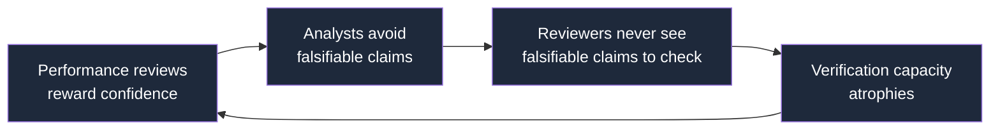
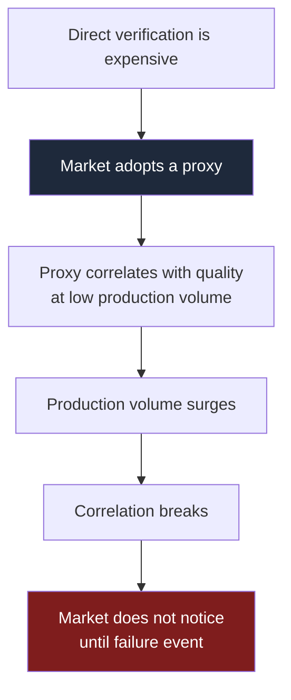

The verification deficit is the operational problem underneath AI-augmented analysis. The executive AI conversation has been organized around facts and hallucinations. The deficit is about reasoning. This page walks from the misframing most organizations are operating under to the diagnosis the rest of the framework is built on.

<Note>
  **Three minute read.** Most executive AI guidance is scoped to the wrong problem. Hallucinations are detectable. The real risk has moved one layer down: AI output that reads cleanly, fact-checks, and still reasons badly. Different problem, different fix. The historical parallel is pre-2008 credit ratings.
</Note>

## Most executive AI guidance is solving last year's problem

The questions executives are asking about AI in 2026 are the questions that mattered in 2024 and 2025. They were the right questions then. They are the wrong questions now.

<CardGroup cols={2}>
  <Card title="What the 2024-2025 toolkit solved" icon="circle-check">
    - Hallucinations (detectable, mostly fixed)
    - Citation grounding (improved across major models)
    - Disclosure frameworks (NIST AI RMF, EU AI Act, ISO 42001)
    - AI use policies inside organizations
    - Designated AI risk functions
  </Card>

  <Card title="What it did not solve" icon="circle-xmark">
    - Reasoning that holds up under expert challenge
    - Unsupported causal claims dressed as analysis
    - Missing boundary conditions on confident predictions
    - Phantom precision in numbers presented as data
    - The fact that polished output and sound reasoning are now decoupled
  </Card>
</CardGroup>

The misframing is not anyone's fault. The remediation followed the visible failure mode. The visible failure mode changed. The remediation did not.

<Warning>
  **The kind of sentence that passes every 2025 control and still fails:**

  *"Mid-market companies that deployed generative AI tools in 2025 saw 18% productivity gains in their go-to-market functions, with the largest effects concentrated among sales development reps and account executives."*

  Every fact in the sentence checks out. AI deployment is happening. Mid-market is a real segment. Productivity gains have been reported. SDRs and AEs use these tools. A fact-checker passes it.

  A reasoning-checker does not.

  - **"18% productivity gains"** is phantom precision. Productivity measured how? Calls dialed, pipeline created, revenue closed? Each one is a different 18%.
  - **"Mid-market companies that deployed"** is self-selection. The companies that deployed gen AI were also the companies investing in better tooling, better hires, and better playbooks. The deployment took credit for the whole improvement.
  - **"Concentrated among SDRs and AEs"** is an observational claim with no comparison group, no baseline, no methodology, and no source.

  The sentence didn't lie. It left out everything that would let you weigh it. That is the failure no fact-checker catches.
</Warning>

## The verification deficit, in one comparison

Production cost has fallen by a factor of one hundred to one thousand against human equivalents. Verification cost has not moved. The gap is the operational risk.

| Cost layer | 2020 | 2026 | Change |
|---|---|---|---|
| **Producing 1,000 words of polished analytical prose** | $5 to $15 (mid-career analyst time) | Well below $0.01 (mainstream model API) | ~100x to 1,000x cheaper |
| **Verifying that the 1,000 words reasons correctly** | Hours of expert review, plus access to source data | Hours of expert review, plus access to source data | Unchanged |

The production layer has been industrialized. The verification layer has not. The result inside any organization that has adopted AI-assisted drafting:

<Steps>
  <Step title="More polished analytical artifacts are produced">
    Often 10x to 40x the volume of two years ago.
  </Step>
  <Step title="Review capacity has stayed flat">
    The slow checks were the first thing cut under throughput pressure.
  </Step>
  <Step title="Unverified claims circulate at an order of magnitude greater volume">
    The probability that any specific deck contains an unverified load-bearing claim has not fallen with the cost. It has risen with the volume.
  </Step>
</Steps>

The verification deficit was always there. AI did not create it. AI revealed it. Before AI, the speed of human production limited the rate at which unverified claims could circulate. That speed limit was not a filter. It was a throttle. Any individual claim was not made more rigorous by the throttle. There were simply fewer claims in flight at any given moment. AI removed the throttle. The deficit became visible.

<Info>
  **The verification deficit was always there.**

  In 2015, the [Open Science Collaboration](https://doi.org/10.1126/science.aac4716) tried to replicate 100 peer-reviewed psychology findings.

  ~36% replicated.

  Before AI. Before models could draft. Before any of the production-cost collapse this framework describes.

  AI did not create the deficit. AI made it harder to ignore.
</Info>

## Why your existing controls do not catch it

Review systems formalize prose, presentation, and process. They do not formalize structural-reasoning checks. The asymmetry is rational, not accidental, and it explains why disclosure and review regimes do not close the gap.

| What review systems formalize | What they do not formalize |
|---|---|
| Clarity of prose | Whether causal claims are supported |
| Citation format and registration | Whether assumptions are stated |
| Data sharing and availability | Whether boundary conditions are named |
| Plagiarism detection | Whether conclusions are testable |
| Statistical method correctness | Whether the mechanism is specified |

The reason is mechanical:

<Tip>
  **The four-second rule.**

  A reviewer can check whether a sentence reads well in roughly four seconds.

  A reviewer can check whether the causal claim it makes is supported in roughly four hours, plus domain expertise, plus access to source data.

  When volume rises and staffing stays flat, the slow checks are the first to go.
</Tip>

The incentive system inside organizations reinforces the asymmetry. The failure compounds through a feedback loop:

When analysts are publicly named and legally exposed, the rules themselves push toward hedged language. [FINRA Rule 2241](https://www.finra.org/rules-guidance/rulebooks/finra-rules/2241), which governs U.S. equity research analysts, is a representative example. Hedged language survives legal review, keeps the client comfortable, and cannot be demonstrated to be wrong. The system selects for prose that sounds authoritative while committing to nothing testable.

<Warning>
  **Disclosure as theater.**

  Disclosure frameworks ([NIST AI RMF](https://www.nist.gov/itl/ai-risk-management-framework), [EU AI Act](https://eur-lex.europa.eu/eli/reg/2024/1689/oj), [ISO/IEC 42001](https://www.iso.org/standard/81230.html)) address a different problem.

  They check what tool was used.

  They do not check whether the reasoning is sound.

  The completed disclosure form is what makes everyone feel comfortable. Without anyone checking the underlying work.
</Warning>

Even the most disciplined formalized verification systems are partial. The U.S. intelligence community's Structured Analytic Techniques, codified in the [CIA Tradecraft Primer](https://www.cia.gov/resources/csi/static/Tradecraft-Primer-apr09.pdf) and [ICD 203](https://www.dni.gov/files/documents/ICD/ICD-203.pdf), force analysts to surface assumptions through explicit protocols. Recent scholarship questions whether these techniques reliably eliminate reasoning errors in field conditions. If the most rigorous formalized verification system in the world is partial, a checkbox disclosure regime cannot close the structural gap.

## The pattern has played out before

Cheap production. Unchanged review processes. Proxy-based trust. The architecture is not new. It produced the largest single financial collapse of the post-war era.

| | 2000-2008 credit ratings | 2024-2026 AI-augmented analysis |
|---|---|---|
| **Cheap production** | Quantitative models scoring securities faster than any human team | LLMs drafting 1,000 words for less than one cent |
| **Unchanged review** | Methodology documents and a century-old brand | Style guides, fact-checkers, disclosure labels |
| **Trust proxy** | AAA stamp | Polished prose |
| **Volume** | ~30 mortgage securities rated triple-A every working day in 2006 | Unbounded |
| **Visible until failure** | No | No |
| **Cost when it failed** | Trillions | TBD |

(Financial Crisis Inquiry Commission, [*The Financial Crisis Inquiry Report*](https://www.govinfo.gov/content/pkg/GPO-FCIC/pdf/GPO-FCIC.pdf), 2011, Chapter 7.)

<Info>
  **The Moody's numbers, plainly:**

  - **2006:** ~30 triple-A mortgage ratings issued. Every working day.
  - **2000-2007:** ~45,000 mortgage-related securities rated triple-A in total.
  - Many defaulted within months of issuance.

  Same architecture, different decade.
</Info>

The mechanism that produced the failure is the same mechanism operating in analytical content now:

The fix in adjacent domains has been consistent. When failure becomes visible enough, buyers demand proof artifacts.

<Tip>
  **How the correction arrives, in adjacent domains:**

  - **2008 banking** → U.S. regulators required institutions to validate every material model assumption ([SR 11-7](https://www.federalreserve.gov/boarddocs/srletters/2011/sr1107.htm), 2011; updated by SR 26-2 in 2026).
  - **Cybersecurity procurement** → vendors moved from self-reported compliance to penetration-test evidence and SOC 2 attestations. The 2026 SOC 2 criteria emphasize continuous risk assessment and earlier security artifacts in procurement.
  - **ESG reporting** → in the middle of the same shift right now.

  The pattern: when the cost of being wrong exceeds the cost of demanding proof, buyers force the correction.
</Tip>

The analogy has limits. Credit ratings carried regulatory force and directly triggered capital requirements. A consulting deck does not trigger margin calls. The structural mechanism, however, is identical: proxy-based trust substitutes for verification, and the substitution is invisible until it fails.

The framework that follows on the rest of this site is built on that pattern. The next pages walk through what proof artifacts look like for analytical content, what posture executives should adopt toward AI verification, and what to demand from the systems and vendors they depend on.

## Where this goes next

<CardGroup cols={3}>
  <Card title="The Doctrine" icon="shield" href="/the-doctrine">
    Zero Trust as the meta-principle. The three layers (Independence, Doctrine, Accountability) and what they rule out.
  </Card>

  <Card title="The Buyer's Checklist" icon="list-check" href="/buyers-checklist">
    Seven procurement questions to put to any AI verification vendor. Red flags, scoring, the buyer's lever.
  </Card>

  <Card title="Lane Discipline" icon="signs-post" href="/lane-discipline">
    Decision-grade vs. volume-grade output. How to classify at point of production. How to prevent slippage.
  </Card>
</CardGroup>
