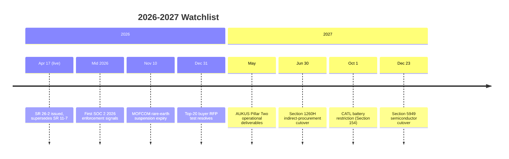

A framework that does not specify how it could be wrong is not a framework. It is a marketing claim. This page lists the dated signals over the next eighteen months that will tell you whether the analysis on this site is right about timing, right about mechanism, or wrong about both.

Read each signal as a falsification candidate. If the signal resolves one way, the framework strengthens. If it resolves the other way, the framework weakens. The page is built to be updated as resolutions arrive.

<Note>
  **Three minute read.** Five categories of signal. The most important is the buyer-side test: do high-stakes purchasers start demanding proof artifacts in 2026 RFPs. The substrate-level signals from regulatory cliffs in late 2026 and 2027 tell you whether the broader shift this framework sits within is propagating on schedule. Capital-market signals are noisier but informative.
</Note>

## The 18-month timeline at a glance

## The primary falsification test

This is the single signal that most directly tests the framework. If it resolves the wrong way, the framework's timing is wrong and you should adjust accordingly.

**Watch:** Top-20 consulting clients, the largest institutional investors, and government procurement offices. Look at their 2026 RFP acceptance criteria for analytical content.

**Watch through:** December 31, 2026.

<CardGroup cols={2}>
  <Card title="Framework holds if" icon="circle-check">
    Even one of them requires structural-transparency artifacts (assumption registers, claim-source maps, boundary conditions, alternative explanations, or any equivalent proof artifact) as a condition of contract by the end of 2026.
  </Card>
  <Card title="Framework weakens if" icon="circle-xmark">
    All of them renew their major analytical-content contracts through 2026 without asking for proof artifacts in their acceptance criteria.
  </Card>
</CardGroup>

If the framework weakens on this signal, the correction is not arriving in this market cycle. Two interpretations are possible: the mechanism is wrong (buyers will not move on this), or the timing is delayed (a public failure event has not yet activated the lever). Either way, recalibrate.

## Regulatory signals

Already in force as of May 2026. Track for implementation severity, waiver applications, and enforcement actions that signal whether the regulatory perimeter is real or theatrical.

| Signal | Date in force | What to watch for | What it means |
|---|---|---|---|
| **[SR 26-2](https://www.federalreserve.gov/supervisionreg/srletters/SR2602.pdf)** Revised Guidance on Model Risk Management | April 17, 2026 | First material enforcement action against a major bank for inadequate AI/model validation | Leading indicator that buyer-side correction is real and propagating |
| **GENIUS Act** implementation | July 18, 2025 onward | First OCC enforcement against a stablecoin issuer for inadequate attestation; substantive vs perfunctory BDO attestations for Tether USA₮ | Tests whether the federal coalition is enforcing the perimeter or rubber-stamping it |
| **SOC 2 2026 criteria** | 2026 | Enterprise procurement teams pushing 2026 SOC 2 criteria into AI-vendor RFPs | The crossover from security to AI verification procurement |
| **[EU AI Act](https://eur-lex.europa.eu/eli/reg/2024/1689/oj)** high-risk provisions | Staggered 2026-2027 | First regulator-level fine against an AI verification provider for inadequate transparency or oversight | European enforcement typically leads U.S. enforcement by 12-18 months |

## Substrate signals

These come from outside the analytical-content market but bear directly on whether the broader verification-collapse regime described in [Perera and Wickramasinghe's *The Verification Collapse*](https://shanakaanslemperera.substack.com/p/the-verification-collapse) is propagating on schedule.

<AccordionGroup>
  <Accordion title="Nov 10, 2026 — MOFCOM rare-earth suspension expiry">
    China's Ministry of Commerce holds a one-year option to reinstate the October 2025 export-control package on rare earths, lithium batteries, graphite anodes, and related processing technologies.

    **Framework holds if:** Beijing reinstates. The integration race accelerates and procurement signals propagate faster.

    **Framework weakens if:** Beijing extends without conditions and Western diversification stalls.

    *This is the single most important date in the 18-month window. Most other signals take their tempo from how this resolves.*
  </Accordion>

  <Accordion title="May 2027 — AUKUS Pillar Two operational deliverables">
    First publicly-visible test of whether the trilateral defense-technology partnership produces fielded advanced-capability deliverables on the specified timeline.

    **Framework holds if:** At least one operationally visible deliverable enters service.

    **Framework weakens if:** Pillar Two yields zero deliverables fielded by the gate.
  </Accordion>

  <Accordion title="Jun 30, 2027 — Section 1260H indirect-procurement cutover">
    FY24 NDAA Section 805. Legally complex of the three procurement cliffs, with a component exception.

    **Framework holds if:** DoD enforces the cutover meaningfully, even with some waivers.

    **Framework weakens if:** Wholesale Chinese Military Companies List delistings before this date.
  </Accordion>

  <Accordion title="Oct 1, 2027 — CATL battery restriction">
    FY24 NDAA Section 154. Named-entity prohibition on DoD procurement from CATL, BYD, Envision, EVE Energy, Gotion, and Hithium.

    **Framework holds if:** Restriction binds at operational severity with limited waivers; Western battery-substitution capacity comes online.

    **Framework weakens if:** Broad waivers issued; no meaningful enforcement.
  </Accordion>

  <Accordion title="Dec 23, 2027 — Section 5949 semiconductor cutover">
    FY23 NDAA Section 5949. Federal executive-agency procurement prohibition on covered semiconductors traceable to SMIC, CXMT, YMTC, or affiliates.

    **Framework holds if:** Final rule preserves the cutover with limited exceptions.

    **Framework weakens if:** FAR Council softens the cutover with broad waivers.
  </Accordion>
</AccordionGroup>

## Capital market signals

Noisier than regulatory signals but informative about how capital is pricing the substrate transition.

| Signal | What to watch for | Framework implication |
|---|---|---|
| **Anduril Series H pricing** | Reported in marketing since Feb 2026 at targeted post-money above $60B | Holds at or above target. Weakens below ~$45B or failure to close. |
| **Helsing trajectory** | Subsequent Bundeswehr trial outcomes after Feb 2026 framework compression (€4.3B → €2B) | Holds if European autonomy-stack capital continues at ~25% of U.S. Weakens if it compresses further. |
| **Public autonomy names** (AeroVironment, Kratos, DroneShield) | Whether the public/private valuation gap persists, narrows, or inverts | Persistent gap supports substrate-transition thesis. Convergence weakens it. |
| **Stablecoin Treasury demand** | Tether at $127B in U.S. Treasuries as of Jun 2025. Apollo projects $2T stablecoin market cap by 2028 | Continued growth strengthens monetary-substrate thesis. Material deceleration weakens it. |

## Technology and capability signals

Less time-bound than regulatory cliffs but worth tracking for inflection points.

<CardGroup cols={2}>
  <Card title="Powerful AI emergence" icon="microchip">
    **Window:** Late 2026 or early 2027 (per Anthropic's OSTP submission).

    **Watch for:** First independently-verified general-capability inflection.

    **Implication:** The framework's verification-deficit thesis intensifies sharply at any such inflection.
  </Card>

  <Card title="Directed-energy operational scale" icon="bolt-lightning">
    **Window:** Iron Beam reached IDF operational status Dec 28, 2025. Target: 14 batteries for national impact.

    **Watch for:** Threshold being reached; first non-U.S./non-Israel allied directed-energy battery operational.

    **Implication:** Confirms the kinetic-substrate transition Perera/Wickramasinghe describe.
  </Card>

  <Card title="Deepfake-based fraud growth" icon="user-secret">
    **Window:** Ongoing. Arup $25M fraud Jan 2024. JINKUSU CAM targeting financial-services liveness checks now.

    **Watch for:** First board-level corporate liability event from deepfake-based fraud at a Fortune 500 company.

    **Implication:** That event activates the identity-verification analog of the analytical-content correction.
  </Card>

  <Card title="AI verification procurement signals" icon="magnifying-glass-dollar">
    **Window:** 2026.

    **Watch for:** Any major enterprise RFP that includes Zero-Trust-style architectural questions from this site's Buyer's Checklist.

    **Implication:** First procurement-side evidence that the framework's primary thesis is propagating.
  </Card>
</CardGroup>

## How to use this page

<Steps>
  <Step title="Review monthly">
    Resolved signals get marked. Pending signals stay on the watchlist. New signals get added as the framework develops.
  </Step>

  <Step title="Track resolution direction">
    Each signal that resolves contributes either to "framework holds" or "framework weakens." Keep a running tally. A framework that is consistently being weakened by its own falsification candidates should be revised, not defended.
  </Step>

  <Step title="Reassess timing at each gate">
    The MOFCOM decision in November 2026 is the first major gate. If the rare-earth suspension is extended, the broader substrate transition is delayed and the firm-level timing this framework specifies probably extends correspondingly.
  </Step>

  <Step title="Watch the primary falsification test most closely">
    The top-20 consulting clients renewals are the single most direct test of the framework's core prediction. If that signal resolves against the framework, recalibrate even if the substrate signals are mixed.
  </Step>
</Steps>

<Tip>
  **The single calendar date worth marking:** November 10, 2026.

  The MOFCOM rare-earth suspension expiry is the inflection where the substrate transition either accelerates into 2027 or defers. Most of the other signals on this page take their tempo from how that decision resolves.
</Tip>

## Where this goes next

<CardGroup cols={3}>
  <Card title="The Frame" icon="diagram-project" href="/the-frame">
    The diagnosis: why current AI controls miss the real problem.
  </Card>
  <Card title="The Doctrine" icon="shield" href="/the-doctrine">
    The posture: Zero Trust applied to AI verification.
  </Card>
  <Card title="The Buyer's Checklist" icon="list-check" href="/buyers-checklist">
    The action: seven questions to put to AI vendors.
  </Card>
</CardGroup>

The Watchlist closes the framework's v1. The framework is intended to evolve as the signals resolve. Substantive disagreements and corrections are welcome through the repository's issues and pull requests. The doctrine improves when it is contested.
